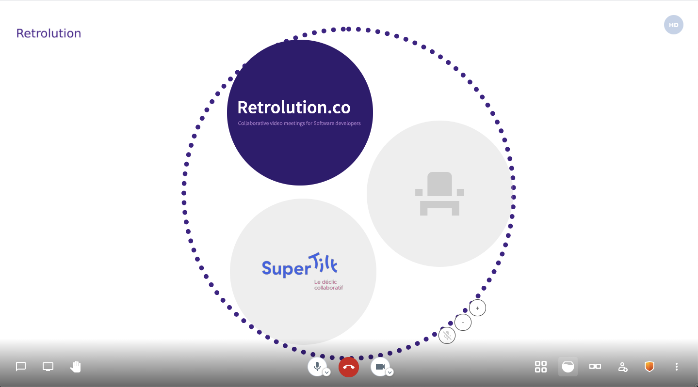

# Open Fishbowl - Open-source implementation of the Fishbowl protocol

Open Fishbowl is the digital implementation of a well known conversational protocol,
the Fishbowl. [See Fishbowl on Wikipedia](https://en.wikipedia.org/wiki/Fishbowl_(conversation))

You can use the protocol by using going on https://retrolution.github.io/open-fishbowl

This project is based on the [Jitsi Meet](https://github.com/jitsi/jitsi-meet) open source codebase, and adds a new layout to it. We are very gratefull of the amazing team behing Jitsi.
We don't think this project would fit inside the Jitsi Repo as it does not fit with the general purpose of Jitsi. That is why we decided to go with a fork. The original Readme.md can be found [here](./JITSI_README.MD)

# The team

This project is so the collaboration of two persons, [Romain Couturier](https://twitter.com/romaincouturier), Agile coach, facilitator and founder or [SuperTilt](https://supertilt.fr/) and [Maxence Dalmais](https://www.linkedin.com/in/maxencedalmais/) founder of [Retrolution](https://www.retrolution.co)

# Goal

The fishbowl is a conversational protocol which helps to split the discussion time across meeting participants. It is usefull when willing to get differents points of view on a topic. It can be quickly described as a round table with a dynamic list of participants.

# Implementation

In the current implementation, one participant is the meeting Moderator. The moderator has super power that enable it to add or remove seat to/from the table, of change participants position.

Other participants are by default outside the fishbowl, and the fishbowl is disable: the conversation an occure in a free way.

Once the moderator activate the fishbowl, participants outside the fishbwol are automatically muted. Only participants with a seat inside the fishbowl can speak.

This means that any participants willing to add something to the discussion, should first enter the fishbowl. But, the fishbowl as limited capacity and should always dispose of a free seat. When the fishbowl is full, somebody inside it should leave. If nobody wish to leave, this is the moderator responsability to remove someone.
